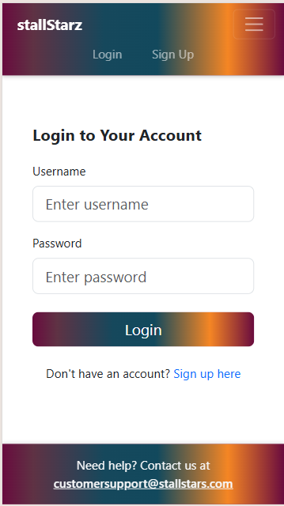

# StallStarz - Restroom Finder Application 🚻

StallStarz is a user-friendly web application designed to help users find nearby public restrooms. Listings include detailed amenity information and directions. Users also have the ability to rate and review public restrooms.

## Live Demo
[Visit StallStarz](https://stallstarz.onrender.com)

## Table of Contents
1. [Features](#features)
2. [Technologies Used](#technologies-used)
3. [API Integrations](#api-integrations)
4. [Screenshots](#screenshots)
5. [Getting Started](#getting-started)
6. [Project Structure](#project-structure)
7. [Authentication](#authentication)
8. [API Routes](#api-routes)
9. [License](#License)
10. [Contact Information](#Contact-Information)

## Features
- User authentication (signup/login)
- Location-based restroom search
- Detailed amenity information for each restroom
- Distance calculation from search location
- Integrated directions via Google Maps
- Mobile responsive design
- Pagination for search results
- Review and ratings functionality

## Technologies Used
- **Frontend**:
  - React
  - TypeScript
  - React Bootstrap
  - React Router
  - JWT Authentication
  
- **Backend**:
  - Node.js
  - Express
  - PostgreSQL
  - Sequelize ORM
  - JWT for authentication

## API Integrations
- OpenCage Geocoding API for location search
- Overpass API for restroom data
- Google Maps for directions

## Screenshots
 
 
 

## Getting Started
1. Clone the repository
```bash
git clone [https://github.com/Ddan71117/stallStarz]
```

2. Install dependencies
```bash
# Install root dependencies
npm install

# Install client dependencies
cd client
npm install

# Install server dependencies
cd ../server
npm install
```

3. Set up environment variables
```env
# Server .env
NODE_ENV=development
PORT=3000
DB_HOST=localhost
DB_PORT=5432
DB_USERNAME=your_username
DB_PASSWORD=your_password
DB_NAME=auth_app
JWT_SECRET=your_secret

# Client .env
VITE_OPENCAGE_API_KEY=your_api_key
```

4. Start the development servers
```bash
# Root directory
npm run dev
```

## Project Structure
```
stallstarz/
├── client/
│   ├── src/
│   │   ├── components/
│   │   ├── pages/
│   │   └── utils/
│   └── public/
└── server/
    ├── src/
    │   ├── controllers/
    │   ├── middleware/
    │   ├── models/
    │   └── routes/
    └── config/
```

## Authentication
- JWT-based authentication
- Protected routes for authenticated users
- Token verification for API requests

## API Routes
- **Auth Routes**:
  - POST `/api/auth/signup` - Create new account
  - POST `/api/auth/login` - User login
  - GET `/api/auth/verify` - Verify JWT token

## License
MIT License

## Contact and Authorship Information

For support or inquiries:
- Developers: Daniel Drennen, Parker Mikesell, Morgan Troper, Calvin Irwin and Amit Nandy
- Additional code sourced from ChatGPT
- GitHub: https://github.com/Ddan71117
